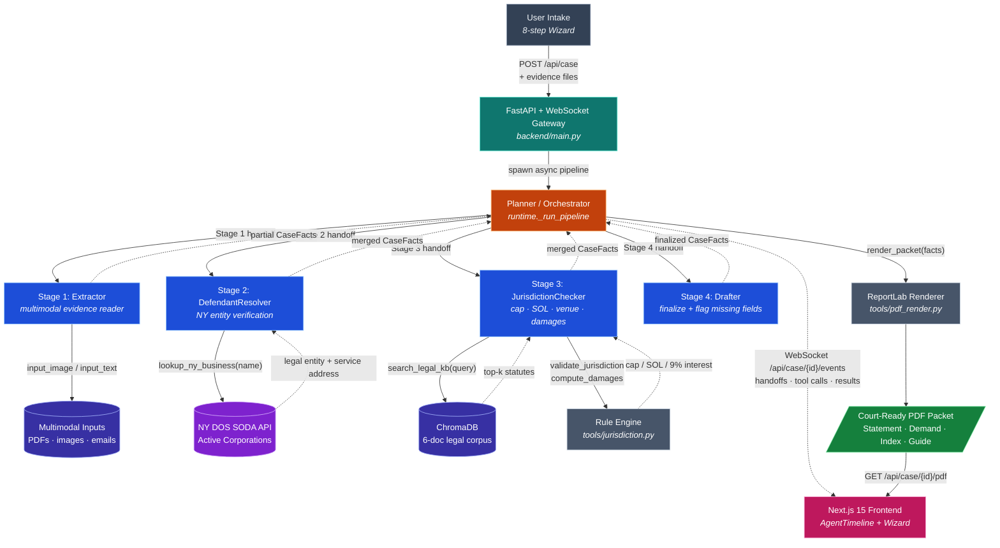

# ClaimReady

**AI-powered small-claims complaint generator for NYC Civil Court.**

ClaimReady is a multi-agent system that takes a freelancer's unpaid-invoice evidence — contracts, emails, invoices, screenshots — and produces a court-ready PDF packet: a Statement of Claim (mirroring the official CIV-SC-50 form), a demand letter, an exhibit index, and a borough-specific filing guide. The entire pipeline runs in under 60 seconds.

**Scope:** NYC small claims only | Breach of contract for unpaid services | Defendant must be a NY-registered LLC/Corp | Output is PDF (no e-filing)

---

## Live Demo

**Frontend:** https://claimready-frontend-7pj7nolpla-ue.a.run.app

**One-click demo:** Open the frontend → click **"Run the sample case"** on the welcome screen. No signup or typing required. You'll watch four specialist agents hand off in real time, see tool calls against the live NY DOS API, and download the resulting PDF packet in ~30–60 seconds.

The bundled scenario: a Brooklyn freelance designer owed $4,800 by an NYC marketing LLC, backed by a signed contract, invoice, email thread, and follow-up notes.

<details>
<summary>Programmatic demo (no UI)</summary>

```bash
# Kick off the demo run
CASE=$(curl -sS -X POST -H "Content-Length: 0" \
  https://claimready-backend-7pj7nolpla-ue.a.run.app/api/demo/run \
  | python -c "import sys,json; print(json.load(sys.stdin)['case_id'])")

# Poll until PDF is ready (~60s)
until curl -fsS -o packet.pdf \
  "https://claimready-backend-7pj7nolpla-ue.a.run.app/api/case/$CASE/pdf"; do
  sleep 5
done && open packet.pdf
```

</details>

---

## How It Works

### User Flow

The frontend presents an 8-step guided wizard:

1. **Welcome** — overview + one-click demo option
2. **Plaintiff** — your name, address, contact info
3. **Defendant** — business name (the system resolves the rest via NY DOS)
4. **Contract** — date, scope of work, agreed amount, payment terms
5. **Breach** — date payment was due, amount owed, venue borough and basis
6. **Evidence** — upload contracts, invoices, emails, screenshots, and notes
7. **Review** — confirm the intake before generation
8. **Run** — watch agents execute, download PDF

### Agent Pipeline

When the user submits, the backend orchestrates a four-agent pipeline coordinated by a Planner. Each specialist produces structured output (`CaseFacts` Pydantic model), the Planner merges partial results across handoffs, and after the Drafter completes the backend renders the PDF using ReportLab. See the [architecture diagram](#architecture) below for the full data flow.

### Real-Time Visibility

The frontend connects via WebSocket to stream every pipeline event as it happens — agent handoffs, tool calls with arguments, tool results, and the final output. This is rendered in an interactive timeline so you can watch the agents think.

---

## Class Concepts Implemented

ClaimReady demonstrates eight core concepts from *IEOR E4576 Agentic AI for Analytics*:

1. **Agent Framework** — Built on the OpenAI Agents SDK using the `Agent`, `Runner.run_streamed`, and `handoffs` primitives, with Vertex AI Gemini 2.5 Flash as the underlying LLM via LiteLLM. See [backend/runtime.py](backend/runtime.py) and [backend/main.py](backend/main.py).

2. **Multi-Agent Pattern (Orchestrator-Handoff)** — A Planner orchestrates four specialist agents (Extractor, DefendantResolver, JurisdictionChecker, Drafter), each with its own system prompt, tool set, and responsibility. The Planner enforces a fixed handoff order and merges partial `CaseFacts` results across the pipeline. See [backend/runtime.py:133](backend/runtime.py:133).

3. **Tool Calling** — Specialist agents call four real tools: `lookup_ny_business` (NY DOS API client), `validate_jurisdiction` (cap/SOL/venue rule engine), `compute_damages` (statutory interest computation), and `search_legal_kb` (RAG retrieval). See [backend/tools/](backend/tools/).

4. **Structured Output / Constrained Generation** — Every agent declares `output_type=CaseFacts`, forcing the LLM to emit a typed Pydantic model. No free-text reasoning passes between agents — only validated structured data, which makes merging across handoffs reliable. See [backend/schema.py](backend/schema.py).

5. **RAG (Retrieval-Augmented Generation)** — ChromaDB ingests a curated 6-document legal corpus (CCA 1805, CPLR 213(2), CPLR 5004, venue rules, filing procedure, sample complaint) at startup; the JurisdictionChecker queries it to ground its validation in authoritative statutes rather than the model's training data. See [backend/tools/rag.py](backend/tools/rag.py) and [backend/corpus/](backend/corpus/).

6. **Multimodal Reasoning** — Image evidence (PNG/JPG/GIF/WebP) is converted to base64 data URLs and passed to Gemini 2.5 Flash as `input_image` parts alongside extracted text. The Extractor reads contracts, emails, screenshots, and invoices in a single multimodal prompt. See [backend/main.py:700](backend/main.py:700).

7. **Two Distinct Retrieval Methods** — RAG over a Chroma vector database (legal corpus) **and** live REST API integration with the NY Department of State SODA endpoint (Active Corporations registry, millions of records). Two genuinely different retrieval paths used by different agents for different purposes. See [backend/tools/rag.py](backend/tools/rag.py) and [backend/tools/dos_lookup.py](backend/tools/dos_lookup.py).

8. **Tracing / Observability** — OpenTelemetry instrumentation wraps every pipeline run with a `pipeline.run` span, and a WebSocket event stream pushes every agent handoff, tool call, and tool result to the frontend in real time. The full event log is also persisted to `events.jsonl` per case for replay after restarts. See [backend/tracing.py](backend/tracing.py) and [backend/main.py:391](backend/main.py:391).

---

## Architecture



---

## Tech Stack

| Layer | Technology | Purpose |
|-------|-----------|---------|
| LLM | Gemini 2.5 Flash (Vertex AI) | Multimodal reasoning via LiteLLM |
| Agent Framework | OpenAI Agents SDK | Multi-agent orchestration with handoffs + structured output |
| Backend | Python 3.11 + FastAPI + uvicorn | REST API + WebSocket streaming |
| Vector DB | ChromaDB (local, persisted) | RAG over 6-document legal corpus |
| PDF | ReportLab + pypdf | PDF packet rendering + uploaded PDF text extraction |
| External Data | NY Open Data SODA API | Active Corporations lookup (no auth) |
| Frontend | Next.js 15 (App Router) + React 19 + TypeScript + Tailwind | Wizard UI + real-time event timeline |
| Build & Deploy | uv, Docker, Cloud Build → Cloud Run | Locked Python installs, container builds, automated two-service deploy |

---

## Project Structure

```
.
├── ClaimReady_Business_Document.pdf   # Final business writeup
├── ClaimReady_Business_Document.tex   # LaTeX source for business writeup
├── ClaimReady_Final_Slides.pdf        # Final presentation deck
├── backend/
│   ├── main.py              # FastAPI app — endpoints + agent driver
│   ├── runtime.py           # Planner + 4 specialist agent definitions
│   ├── schema.py            # CaseFacts Pydantic model (structured output)
│   ├── config.py            # Legal constants (cap, SOL, interest rates)
│   ├── demo_scenario.py     # Bundled demo case + evidence
│   ├── events.py            # Event type definitions
│   ├── tracing.py           # OpenTelemetry instrumentation
│   ├── pyproject.toml       # Python dependencies + pytest config
│   ├── uv.lock              # Locked backend dependency graph
│   ├── tools/
│   │   ├── dos_lookup.py    # NY DOS Active Corporations API client
│   │   ├── jurisdiction.py  # Venue validation + damages computation
│   │   ├── rag.py           # Chroma RAG over legal corpus
│   │   └── pdf_render.py    # ReportLab PDF packet renderer
│   ├── corpus/              # Legal knowledge base (6 markdown files)
│   │   ├── 01_cca_1805_monetary_jurisdiction.md
│   │   ├── 02_cplr_213_2_statute_of_limitations.md
│   │   ├── 03_cplr_5004_statutory_interest.md
│   │   ├── 04_venue_rules.md
│   │   ├── 05_filing_procedure.md
│   │   └── 06_sample_complaint_breach_of_contract.md
│   ├── templates/           # Demand letter template
│   ├── scripts/             # Live smoke-test helpers
│   ├── tests/               # pytest suite
│   └── Dockerfile
├── frontend/
│   ├── app/page.tsx         # Main wizard (8 steps)
│   ├── components/
│   │   ├── StepShell.tsx    # Reusable step wrapper
│   │   ├── Field.tsx        # Form field primitives
│   │   ├── DefendantLookup.tsx
│   │   ├── EvidenceUpload.tsx
│   │   ├── AgentTimeline.tsx
│   │   └── steps/           # Individual wizard step components
│   ├── lib/
│   │   ├── api.ts           # Backend client (REST + WebSocket)
│   │   ├── types.ts         # TypeScript interfaces
│   │   └── validation.ts
│   ├── public/sample-evidence/ # Bundled files for the demo case
│   ├── package.json         # Next.js dependencies + scripts
│   ├── tailwind.config.ts   # Tailwind theme
│   ├── tsconfig.json        # TypeScript config
│   └── Dockerfile
├── scripts/
│   └── render_business_doc.py # ReportLab fallback renderer for the writeup
├── dev.sh                   # Local backend/frontend dev launcher
├── cloudbuild.yaml          # GCP Cloud Build pipeline
└── deploy.md                # Deployment instructions
```

---

## Local Development

### Prerequisites

- Python 3.11+ with [uv](https://docs.astral.sh/uv/)
- Node.js 18+
- GCP credentials for Vertex AI (`gcloud auth application-default login`)

### Backend

```bash
cd backend
uv sync
source .venv/bin/activate          # Windows: .venv\Scripts\activate
export GCP_PROJECT_ID=agentic-ai-487000
export GCP_REGION=us-east1
uvicorn main:app --reload --port 8000
```

### Frontend

```bash
cd frontend
npm install
echo "NEXT_PUBLIC_BACKEND_URL=http://localhost:8000" > .env.local
npm run dev    # http://localhost:3000
```

### Running Tests

```bash
cd backend
pytest
```

Fast unit-only checks:

```bash
cd backend
pytest -m "not integration"
```

Live smoke checks against a deployed or local backend:

```bash
cd backend
python scripts/smoke_live.py --base-url https://claimready-backend-7pj7nolpla-ue.a.run.app --timeout 90
# Use --skip-events only when debugging REST/PDF readiness without WebSocket assertions.

# or through pytest
$env:CLAIMREADY_SMOKE_BASE_URL = "https://claimready-backend-7pj7nolpla-ue.a.run.app"
# Optional if the backend has API_KEY configured:
# $env:CLAIMREADY_API_KEY = "..."
pytest -m smoke -q
```

---

## Deployment

Single-command deploy to GCP Cloud Run via Cloud Build:

```bash
gcloud builds submit \
  --config cloudbuild.yaml \
  --substitutions=_REGION=us-east1,_BACKEND_NAME=claimready-backend,_FRONTEND_NAME=claimready-frontend,_AR_REPO=claimready
```

This builds both Docker images, deploys the backend (2 CPU, 2 GiB, 600s timeout), reads its URL, builds the frontend with the backend URL baked in, and deploys the frontend (1 CPU, 512 MiB). Full setup details in [deploy.md](deploy.md).

---

## API Reference

| Method | Endpoint | Description |
|--------|----------|-------------|
| `POST` | `/api/case` | Submit intake + evidence, starts agent pipeline |
| `POST` | `/api/case/prepare` | Allocate a case ID (before evidence upload) |
| `POST` | `/api/case/{id}/evidence` | Upload evidence files, returns extracted text |
| `POST` | `/api/case/{id}/start` | Start pipeline for a prepared case |
| `WS` | `/api/case/{id}/events` | Stream real-time agent events |
| `GET` | `/api/case/{id}/pdf` | Download rendered PDF packet |
| `GET` | `/api/case/{id}/facts` | Get final CaseFacts JSON |
| `POST` | `/api/demo/run` | One-click demo (bundled scenario) |
| `GET` | `/api/demo/scenario` | Get demo scenario metadata |
| `GET` | `/api/healthz` | Health check |

---

## Key Design Decisions

- **Narrow scope by design.** NYC small claims, breach of contract only. This constraint ensures the system can be thorough and correct within its domain rather than shallow across many.
- **Structured output everywhere.** Every agent produces a typed `CaseFacts` Pydantic model. No free-text reasoning passes between agents — just structured data that can be validated and merged.
- **Real external data.** The DefendantResolver calls the live NY Department of State API to verify business registrations. This isn't a mock — it validates real entities.
- **RAG with legal authority.** The JurisdictionChecker retrieves from a curated corpus of NYC statutes (CCA 1805, CPLR 213(2), CPLR 5004) to ground its validation in law.
- **Graceful degradation.** If the agent pipeline fails, the backend falls back to rendering a PDF from the raw intake data so the user always gets something.

---

## Authors

Built by **Arjun Varma** and **Oranich Jamkachornkiat** as a final project for *IEOR E4576 Agentic AI for Analytics* at Columbia University.

---

## Disclaimer

ClaimReady generates documents and educational guidance from public statutes and court forms. It is not a law firm and does not provide legal advice. For a complex case, consult a licensed attorney.
